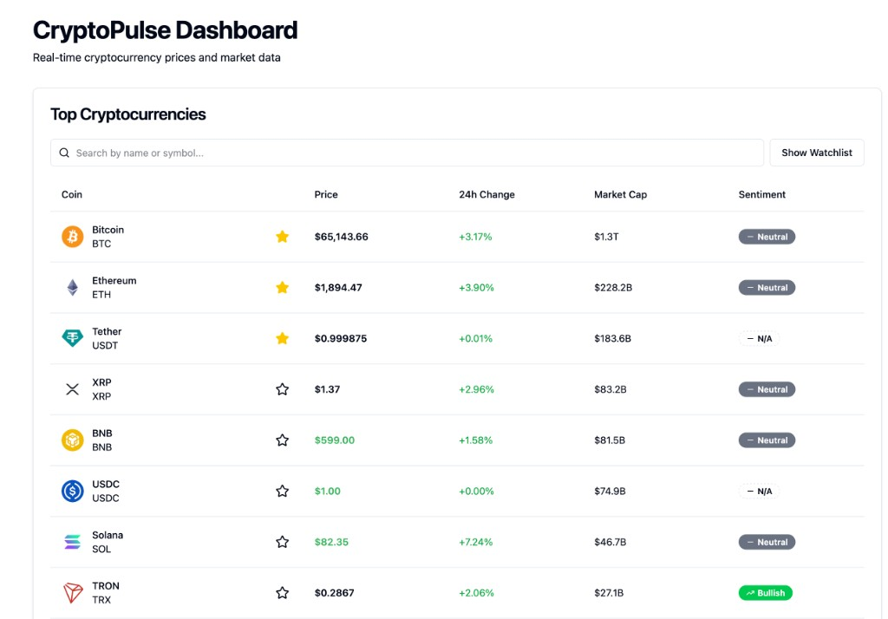
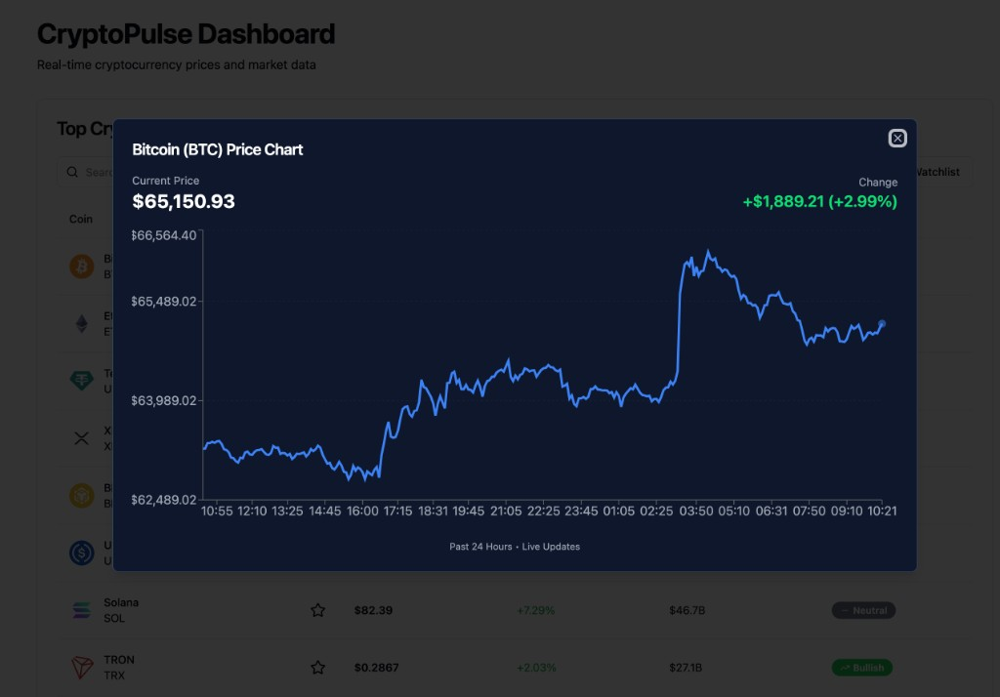

# CryptoPulse Dashboard

A modern, real-time cryptocurrency dashboard built with React, TypeScript, and Redux Toolkit. Displays live cryptocurrency prices with WebSocket updates, interactive charts, and watchlist functionality.



*Bitcoin price chart (24h + live) with AI sentiment analysis:*  


## 🚀 Features

- **Real-time Price Updates**: Live cryptocurrency prices via Binance WebSocket
- **Hybrid Price Charts**: 24h history from CoinGecko API with live-updating tip from Binance WebSocket (Recharts)
- **AI Sentiment in Chart**: Price chart modal includes AI sentiment score in the header and an AI Analysis Insight panel with analysis text and last-updated time
- **Watchlist**: Save favorite cryptocurrencies to LocalStorage
- **Search & Filter**: Find cryptocurrencies by name or symbol
- **Responsive Design**: Mobile-first design that works on all devices
- **Performance Optimized**: `React.memo` and selective re-rendering for smooth UX
- **Error Handling & UI**: Error boundaries, skeleton loaders, and graceful empty states

## 🛠️ Tech Stack

### Core Technologies
- **React 19** - UI library
- **TypeScript** - Type safety
- **Vite** - Build tool and dev server
- **Redux Toolkit (RTK) & RTK Query** - State management, API data fetching, and caching
- **Tailwind CSS** - Utility-first CSS framework
- **Recharts** - Chart library for data visualization

### APIs & Data Sources
- **CoinGecko API** - Cryptocurrency static data and 24h price history (`market_chart`)
- **Binance WebSocket** - Real-time price updates
- **CryptoPulse API** - AI sentiment analysis (score, label, analysis text)

---

## 🧠 Architecture & Technical Deep Dive

Curious about how we synchronized real-time WebSocket data with historical REST API data without causing re-render hell? Or how we handled rate limits and memory management?

Read the full technical breakdown in **[Architecture & Technical Decisions](./ARCHITECTURE.md)**.

---

## 📦 Installation

### Prerequisites
- Node.js 18+ and npm (or yarn/pnpm)

### Setup

1. **Clone the repository**
   ```bash
   git clone <repository-url>
   cd cryptopulse-dashboard
   ```

2. **Install dependencies**
   ```bash
   npm install
   ```

3. **Set up environment variables**
   Create a `.env` file in the root directory based on the `.env.example` file:
   ```bash
   cp .env.example .env
   ```
   **Variables:** `VITE_API_BASE_URL` – Sentiment API base URL (default: `http://localhost:3001/api/v1`).

4. **Start the development server**
   ```bash
   npm run dev
   ```

5. **Open your browser**
   Navigate to `http://localhost:5173`

### Build for Production

```bash
npm run build
```

The production build will be in the `dist` directory.

## 🏗️ Project Structure

```
cryptopulse-dashboard/
├── src/
│   ├── components/
│   │   ├── crypto/          # Cryptocurrency-specific components
│   │   │   ├── CryptoTable.tsx
│   │   │   ├── CryptoRow.tsx
│   │   │   ├── PriceChart.tsx
│   │   │   ├── ChartTooltip.tsx
│   │   │   ├── ChartStatusRow.tsx
│   │   │   ├── AIInsightPanel.tsx
│   │   │   ├── PriceTag.tsx
│   │   │   ├── SearchBar.tsx
│   │   │   ├── SentimentBadge.tsx
│   │   │   └── NoSentimentBadge.tsx
│   │   ├── layout/           # Layout components
│   │   │   └── Dashboard.tsx
│   │   └── ui/               # Reusable UI components (shadcn/ui)
│   │       ├── button.tsx
│   │       ├── card.tsx
│   │       ├── dialog.tsx
│   │       ├── skeleton.tsx
│   │       └── ...
│   ├── features/
│   │   ├── crypto/           # Crypto feature (Redux slice + API)
│   │   │   ├── cryptoSlice.ts
│   │   │   └── cryptoApi.ts
│   │   ├── sentiment/        # AI sentiment feature
│   │   │   └── sentimentApi.ts
│   │   └── watchlist/        # Watchlist feature
│   │       ├── watchlistSlice.ts
│   │       └── watchlistMiddleware.ts
│   ├── hooks/
│   │   ├── redux.ts          # Typed Redux hooks
│   │   ├── useWebSocket.ts   # WebSocket connection hook
│   │   └── useDebounce.ts    # Debounce utility hook
│   ├── services/
│   │   ├── store.ts          # Redux store configuration
│   │   └── websocket.ts     # WebSocket service
│   ├── types/
│   │   ├── chart.ts          # Chart data and tooltip types
│   │   └── crypto.ts         # Crypto and API type definitions
│   ├── utils/
│   │   ├── dateUtils.ts      # Time formatting (e.g. HH:mm for charts)
│   │   ├── localStorage.ts   # LocalStorage helpers
│   │   └── symbolMapper.ts   # CoinGecko ↔ Binance symbol mapping
│   └── constants/
│       ├── text.ts           # Text constants
│       └── styles.ts         # Style constants
├── package.json
├── tsconfig.json
├── vite.config.ts
└── tailwind.config.js
```

## 🎯 Key Features Overview

- **Real-time Engine**: Connects to Binance WebSocket with auto-reconnect and exponential backoff. The Redux slice stores only the latest price per coin to prevent memory leaks.
- **Hybrid Charts**: Merges cached 24h history (CoinGecko) with live WebSocket data in the component, avoiding RTK Query cache mutation. Chart modal displays AI sentiment score in the header and an AI Analysis Insight panel below.
- **O(1) Performance**: Uses `transformResponse` in RTK Query to normalize arrays into dictionaries for instant lookups.
- **Dynamic Formatting**: Smart currency formatter that adapts decimal places by asset value (e.g. micro-caps get up to 6 decimals so they don’t show as $0.00).
- **Symbol Mapping**: Bridges CoinGecko IDs (e.g. `bitcoin`) and Binance pairs (e.g. `BTCUSDT`).

## 📱 Responsive & Accessible UI

- **Mobile-first**: Single-column on small screens, full table on desktop.
- **Graceful Fallbacks**: Missing data (e.g. stablecoin sentiment) handled with dedicated components (e.g. `<NoSentimentBadge />`) and tooltips instead of broken layout.
- **Accessibility**: ARIA labels, keyboard navigation, and focus management.

## 🧪 Development Scripts

- `npm run dev` - Start development server
- `npm run build` - Build for production
- `npm run lint` - Run ESLint
- `npm run preview` - Preview production build locally

## 📄 License

This project is open source and available under the [MIT License](LICENSE).

## 🙏 Acknowledgments

- [CoinGecko](https://www.coingecko.com/) & [Binance](https://www.binance.com/) for the data APIs
- [shadcn/ui](https://ui.shadcn.com/) & [Recharts](https://recharts.org/) for the UI foundation
